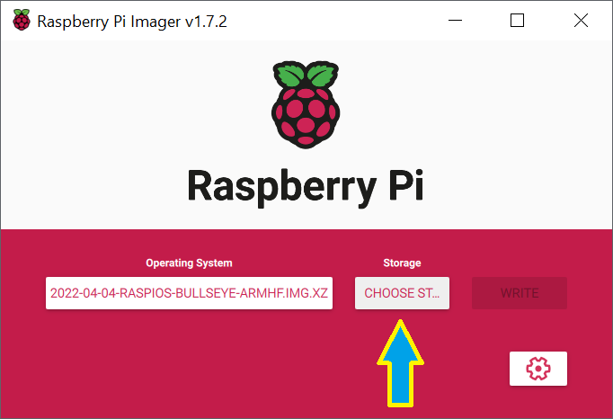

# Boot Software Image (Pi Imager v1.7.2)

To boot Raspberry Pi, create a Micro-SD Card or M2 SSD with Boot Software Image.

These instructions are for Raspberry Pi Imager v1.7.2 or later.

See [SDCARD](./SDCARD.md) for newer Raspberry Pi Imager version.

  1. Download and install "Raspberry Pi Imager" from [raspberrypi.com/software](https://www.raspberrypi.com/software).
  2. (Optionally) download a "Raspberry Pi OS" Operating System image file from [raspberrypi.com/software](https://www.raspberrypi.com/software) to local disk.
  3. Run Raspberry Pi Imager:
     1. Click "CHOOSE OS" button

        

     2. Select one of the listed Raspberry Pi OS images from the drop-down menu. To use previously downloaded image file, scroll down, select "Use custom", then navigate to and choose the downloaded Operating System image file:

        

     3. Insert SD card, Click "CHOOSE STORAGE" button

        

     4. Select SD card (or connect M2 SSD using M2-USB adapter) in the list (Note: all data will be deleted from that SD card / M2 SSD)

        

     5. Click on gears wheel in Raspberry Pi Imager window to set "Advanced options" (Gears wheel only shows up when Operating System image is selected)

        

     6. Select checkboxes and enter info as follows:
        1. Hostname: RPI (capitalized form is recommended, it helps Windows networking)
        2. Enable SSH, use password
        3. Set username and password, Username: pi, Enter your password
        4. WiFi connection information (or plug into wired Ethernet)
        5. Set locale settings

        

     7. Click "WRITE" button

        

     8. Wait for the Write operation to complete, check that there are no errors
