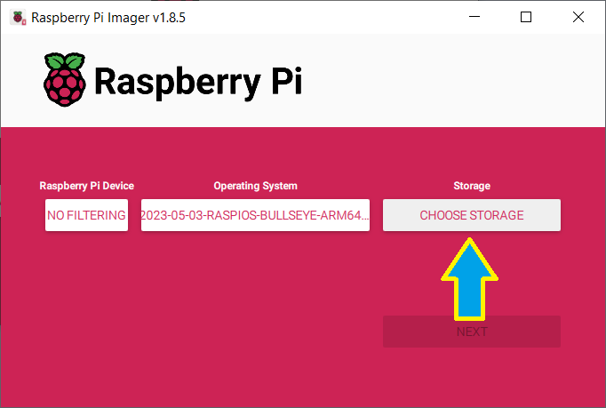
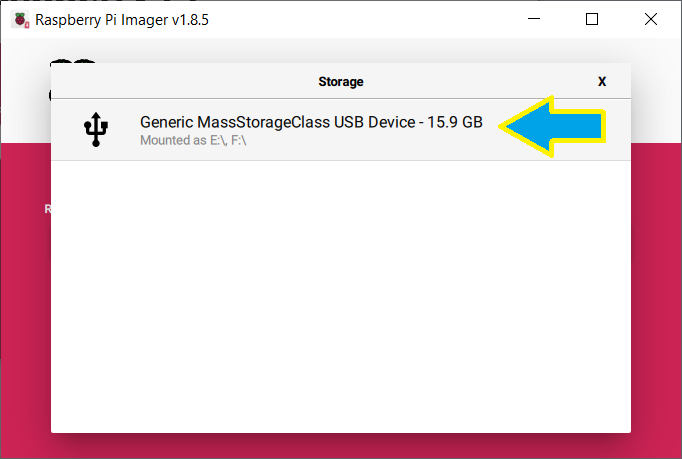
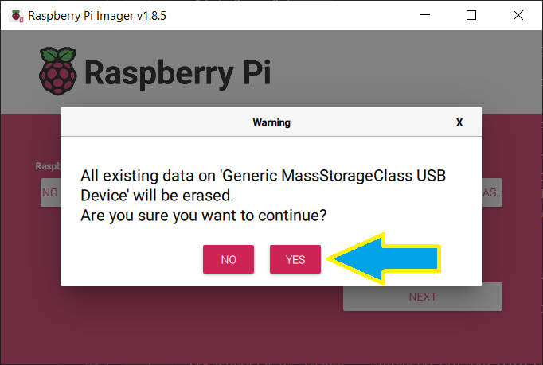

# Create Micro-SD Card or M2 SSD with Boot software image

These instructions are for Raspberry Pi Imager v1.8.5 or later.

See [SDCARD-v1.7](SDCARD-v1.7.md) for older Raspberry Pi Imager version.

  1. Download and install "Raspberry Pi Imager" from [raspberrypi.com/software](https://www.raspberrypi.com/software).
  2. (Optionally) download a "Raspberry Pi OS" Operating System image file from [raspberrypi.com/software](https://www.raspberrypi.com/software) to local disk.
  3. Run Raspberry Pi Imager:
     1. Make sure "Raspberry Pi Device" is set to "NO FILTERING" or to your Raspberry Pi device

        

     2. Click "CHOOSE OS" button

        

     3. Select one of the listed Raspberry Pi OS images from the drop-down menu. To use previously downloaded image file, scroll down, select "Use custom", then navigate to and choose the downloaded Operating System image file:

        

     4. Insert SD card, Click "CHOOSE STORAGE" button

        

     5. Select SD card (or connect M2 SSD using M2-USB adapter) in the list (Note: all data will be deleted from that SD card / M2 SSD)

        

     6. Click "NEXT" button

        

     7. Click "EDIT SETTINGS" button in the popup window to set

        

     8. Click on "GENERAL" tab and Select checkboxes and enter info as follows:
        1. Hostname: RPI (capitalized form is recommended, it helps Windows networking)
        2. Set username and password, Username: pi, Enter your password
        3. Wi-Fi connection information (or plug into wired Ethernet)
        4. Set locale settings

        

     9. Click on "SERVICES" tab and Select checkboxes and enter info as follows:
        1. Enable SSH, use password

        

     10. Click on "OPTIONS" tab and Select checkboxes and enter info as follows:
         1. Play sound when finished: on/off (as desired)
         2. Eject media when finished: on
         3. Enable telemetry: off

         

     11. Click "SAVE" button
     12. Click "YES" button to use OS Customisation

         

     13. Click "YES" button to procees to writing

         

     14. Wait for the Write operation to complete, check that there are no errors, remove the SD card and click "CONTINUE" button

         
